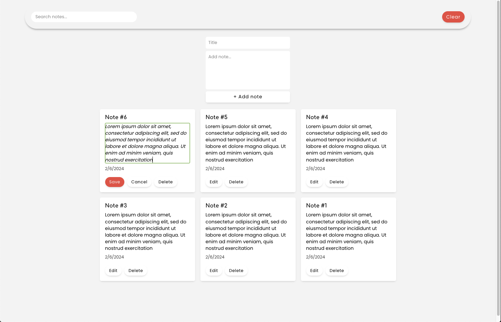

# Notes App

A single-page web application for creating post-it style notes and displaying them in a grid format.

- Users can create, edit, or delete each note
- Notes can be filtered via the search bar
- Clear button deletes all notes on the page
- All data is persisted with the Web Storage API

🔗 **Live site:** [here](https://jacobrobertsdev.github.io/notes-app/)

 
## Built Using

- Mobile-first approach
- HTML
- CSS
- Javascript
- VSCode
- Git
- Google fonts

## Author

👤 **Jacob Roberts**

- GitHub: [Jacobrobertsdev](https://github.com/jacobrobertsdev)
